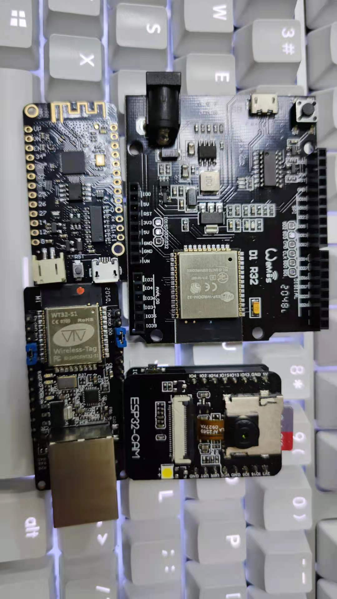

# [ESP32](https://github.com/SoCXin/ESP32)

* [Espressif](https://www.espressif.com/): [Xtensa LX6](https://github.com/SoCXin/MIPS)
* [L5R4](https://github.com/SoCXin/Level): 240 MHz x 2.5 DMIPS/MHz, [160MHz x 4.13 CoreMark/MHz](https://www.eembc.org/coremark/scores.php)

### [xin简介](https://github.com/SoCXin/ESP32/wiki)

[ESP32](https://github.com/SoCXin/ESP32) 拥有丰富完整的外设资源，可以满足大多数嵌入式需求场景，风靡于创客群体。

#### 关键参数

* Xtensa® LX6 240 MHz,40nm, 600 MIPS（ESP32-S0WD 200 MIPS，ESP32-D2WD 400 MIPS）
* 520 KB SRAM (TCM)，448 KB ROM
* 1T1R 802.11 b/g/n WiFi，802.11n速度可达 150 Mbps
* BLE v4.2 +12 dBm，–97dBm
* 3 x UART
* CAN
* Host SD/eMMC/SDIO
* Slave SDIO/SPI
* IEEE 1588 MAC
* 硬件加密单元： AES/RSA/ECC
* 霍尔传感器

### [xin资源](https://github.com/SoCXin)

* [参考资源](src/)
* [相关文档](docs/)
* [典型应用](project/)
* [入门教程](https://docs.soc.xin/ESP32)

### [选型建议](https://github.com/SoCXin/ESP32)

[ESP32](https://github.com/SoCXin/ESP32)

#### xin规格

* QFN48(5x5mm/6x6mm)

### 验证开发板

#### 高可用度开源项目

* [ESP-IDF](https://github.com/espressif/esp-idf)

### [探索芯世界 www.SoC.xin](http://www.SoC.Xin)
