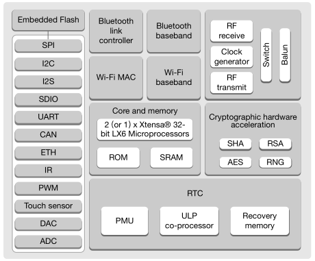
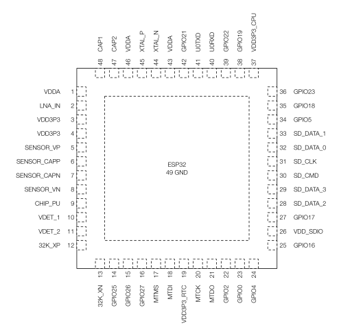
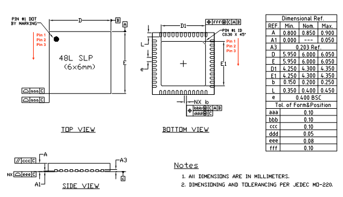
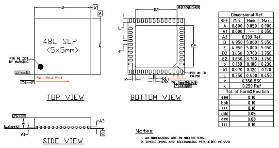

# [ESP32](https://github.com/sochub/ESP32) 

#### 父级：[espressif乐鑫](https://github.com/sochub/espressif)

#### 归属：[MIPS](https://github.com/sochub/MIPS)

### [描述](https://github.com/sochub/ESP32/wiki) 

ESP32采用两个哈佛结构 Xtensa LX6 CPU 构成双核系统，运算能力高达600 MIPS，芯片集成448KB ROM + 520KB SRAM。所有的片上存储器、片外存储器以及外设都分布在两个 CPU 的数据总线和／或指令总线上。

### [资源收录](https://github.com/sochub/ESP32)

软件采用[ESP-IDF](https://docs.espressif.com/projects/esp-idf/en/latest/get-started/index.html)工具框架

- [文档](docs/) 
- [资源](src/) 
- [工程](project/) 

#### [硬件开发资源](https://github.com/sochub/CH579)

* ESP32-D0WDQ6封装：QFN48 （6mm x 6mm）

* ESP32封装：QFN48 （5mm x 5mm）

* [kicad资源](src/kicad/)

###  [SoC资源平台](http://www.qitas.cn)   
